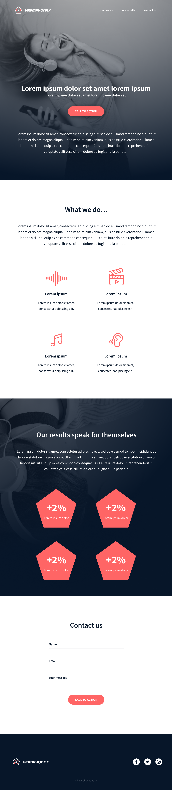

# IMPLEMENT DESIGN FROM SCRATCH
 Practicing the skills of html,css and responsive design to come up with a landing page that is responsive.
 ## Tech Used
 + HTML
 + CSS 
 + RESPONSIVE DESIGN

 ### THE FINAL OUTPUT
+ Desktop Mode

    
+ Tablet Mode

Acknowledging Nicolas Philippot, UI/UX designer who designed the webpage.
